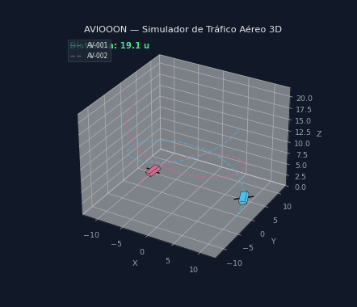

# ✈ AVIOOON — Simulador de Tráfico Aéreo 3D

Simulador interactivo de trayectorias aéreas en 3D. Define aeronaves con
funciones paramétricas `x(t)`, `y(t)`, `z(t)` y observa su vuelo animado,
con **detección de colisiones**, **alertas sonoras** y **métricas de vuelo**.

Proyecto de Cálculo Vectorial — Python + CustomTkinter + Matplotlib + SymPy.



*Dos aeronaves orbitan en direcciones opuestas y colisionan a mitad de
vuelo: la alerta muestra la distancia y el marcador rojo señala el punto
de conflicto. (Generado con `python scripts/make_demo_gif.py`.)*

---

## ✨ Características

- 🛫 **Trayectorias paramétricas**: cada avión se define con expresiones
  matemáticas (`10*cos(t)`, `sin(t)`, …) evaluadas simbólicamente con SymPy.
- 🚨 **Proximidad en tiempo real**: cada fotograma se mide la distancia
  entre todos los pares con tres zonas — 🟡 contacto (<12 u), ⚠ preventiva
  (<8 u) y 🚨 colisión (<3 u) — con marcador rojo y registro de eventos.
- 🔊 **Alertas sonoras por evento**: sonido distinto para cada situación
  (contacto, aproximación, colisión y separación). Se puede silenciar.
- 🎨 **Gestión de vuelos**: agregar, **editar, eliminar y duplicar** aviones,
  elegir color, cargar presets y **guardar/cargar escenarios** en JSON.
- 📊 **Métricas de vuelo**: distancia recorrida, altitud máxima y velocidad
  media por aeronave.
- 📡 **Radar 2D**: vista cenital (XY) con anillos de alcance, posición
  dinámica de cada avión y marcadores de colisión.
- ⏯ **Controles de reproducción**: pausar, reanudar, reiniciar y velocidad
  ajustable (0.25x – 2x).
- 🎞 **Exportación**: animación a **GIF** (o MP4 con `imageio-ffmpeg`) y
  métricas + alertas a **CSV**.
- 🖥 **Interfaz moderna** con CustomTkinter (tema oscuro).

---

## 📦 Requisitos

- Python **3.10+** (desarrollado con 3.11)
- Windows (las alertas sonoras usan `winsound`; en otros sistemas se desactivan)

## 🚀 Instalación

```bash
cd AVIOOON
pip install -r requirements.txt
python main.py
```

## 🎮 Uso

1. Agrega un avión indicando su nombre, funciones `x(t)`, `y(t)`, `z(t)`,
   tiempo de simulación y color.
2. (Opcional) aplica un **preset** de ejemplo o carga un escenario JSON.
3. Pulsa **🚀 Iniciar simulación**.
4. En el visor 3D: pausa, ajusta velocidad y observa el **registro de
   alertas** cuando dos aviones se acerquen.

### Ejemplo rápido

| Avión | x(t) | y(t) | z(t) |
|---|---|---|---|
| OR-001 | `10*cos(t)` | `10*sin(t)` | `t` |
| OR-002 | `10*cos(t+0.2)` | `10*sin(t+0.2)` | `t` |

→ Ambos orbitan muy cerca: se detecta una **colisión** en la animación.

---

## 🗂 Estructura del proyecto

```
AVIOOON/
├── main.py                     # Punto de entrada
├── requirements.txt
├── README.md
├── assets/
│   └── demo.gif                # Demo animada (README)
├── aviooon/                    # Paquete principal
│   ├── config.py               # Constantes y umbrales
│   ├── core/                   # Lógica pura (sin UI)
│   │   ├── aircraft.py         # Modelo de aeronave
│   │   ├── trajectory.py       # Evaluación y muestreo de trayectorias
│   │   ├── collision.py        # Detección de colisiones
│   │   └── simulation.py       # Motor: trayectorias + colisiones + métricas
│   ├── data/
│   │   ├── scenario_manager.py # Presets, guardar y cargar JSON
│   │   └── exporter.py         # Exportación a CSV / GIF / MP4
│   ├── gui/
│   │   ├── main_window.py      # Ventana de configuración
│   │   └── simulation_window.py# Visor 3D animado con alertas
│   └── utils/
│       └── sound.py            # Alarmas sonoras (winsound)
├── scenarios/
│   └── ejemplo.json            # Escenario de ejemplo
├── scripts/
│   └── make_demo_gif.py        # Genera la demo animada del README
└── tests/
    ├── test_collision.py       # Motor: trayectorias, colisiones, métricas
    └── test_export.py          # Exportación CSV y GIF
```

## 🧪 Tests

```bash
python -m unittest discover -s tests -v
```

---

## 🛠 Tecnologías

- [CustomTkinter](https://github.com/TomSchimansky/CustomTkinter) — interfaz
- [Matplotlib](https://matplotlib.org/) — visualización 3D
- [SymPy](https://www.sympy.org/) — evaluación simbólica de trayectorias
- [NumPy](https://numpy.org/) — cálculo numérico

## 👤 Autor

**William Medina Castro** — Proyecto de Cálculo Vectorial · EPIS · 2025
